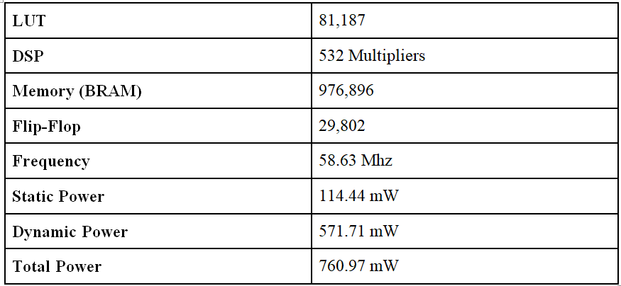

This final project (4 Weeks) for ECE385 is a graphics wire-frame renderer with blender file integration.

It has been tested on 
an Altera FPGA on the DE2-115 board. 

- Runs smoothly as there are 12 render cores running in parallel. 
- Rotation over X-Axis using fixed point math

**How to Use:**

1. Upload SOF file to FPGA 
2. Upload demo C++ program in debug mode with hostfs enabled. This allows for blender file integration. 
3. Note: Uses VGA output and BRAM (internal RAM)

**Note**

	- Due to time constraints of final project the max number of triangles that can be rendered are 12.
	- One improvement that can be made is reducing the embedded multipliers usage to zero by making rotation 
	 multiplication synchronous(Ran out of time for improvement). 
	- Another addition is decimal integration from the blender file.
	 The C++ program doesn't correctly sign extend decimals to 32-bits 
	 Which is needed for fixed point math. (Ran out of time for improvement) 
	- Multiplication and Division modules for the fixed point math were open source.
	   - Credit: https://github.com/freecores/verilog_fixed_point_math_library

**Resource Usage**

